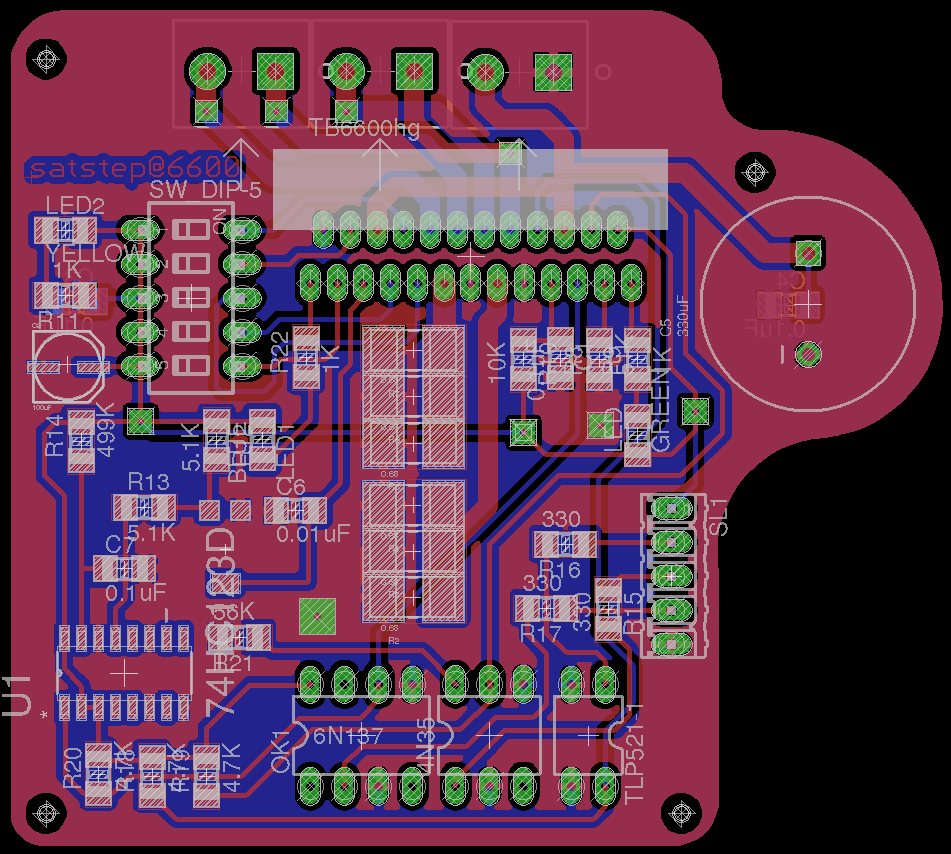
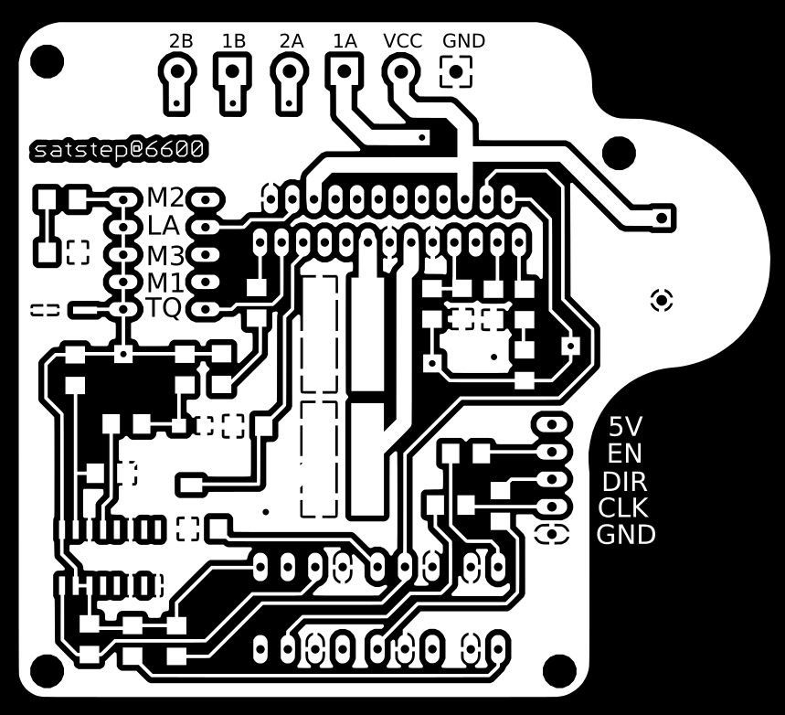
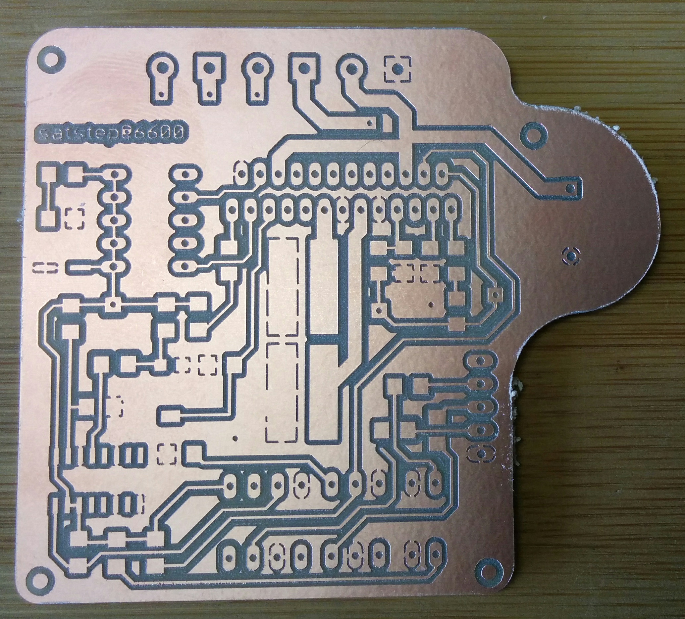
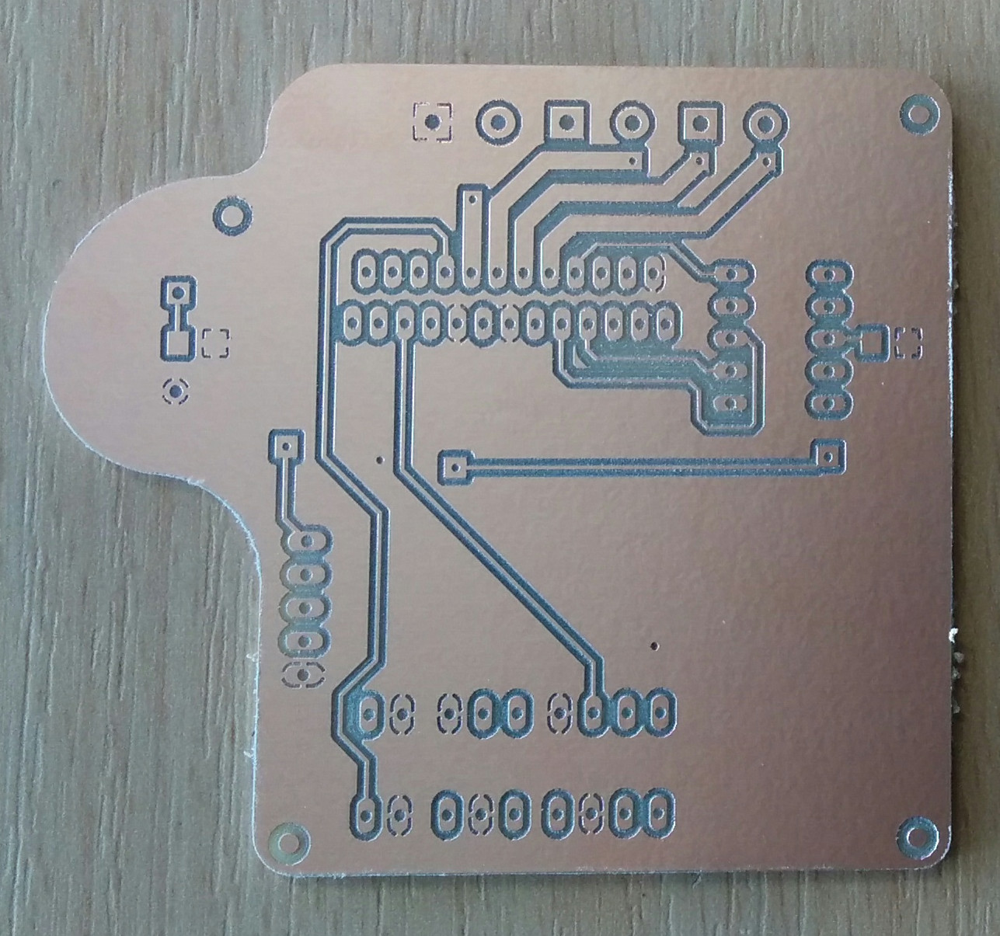
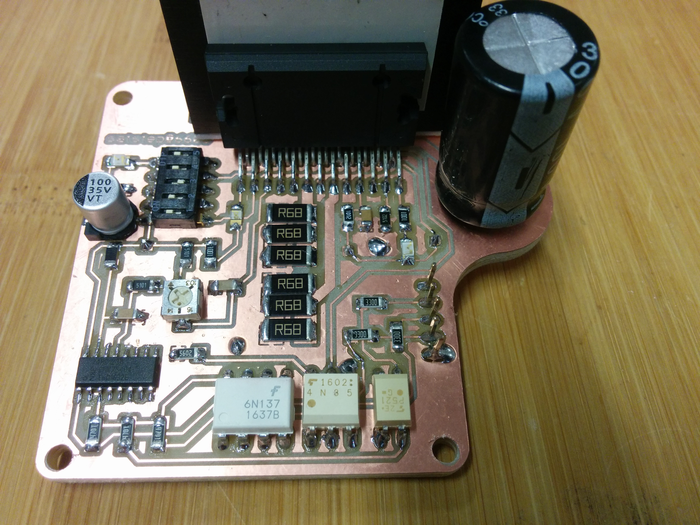
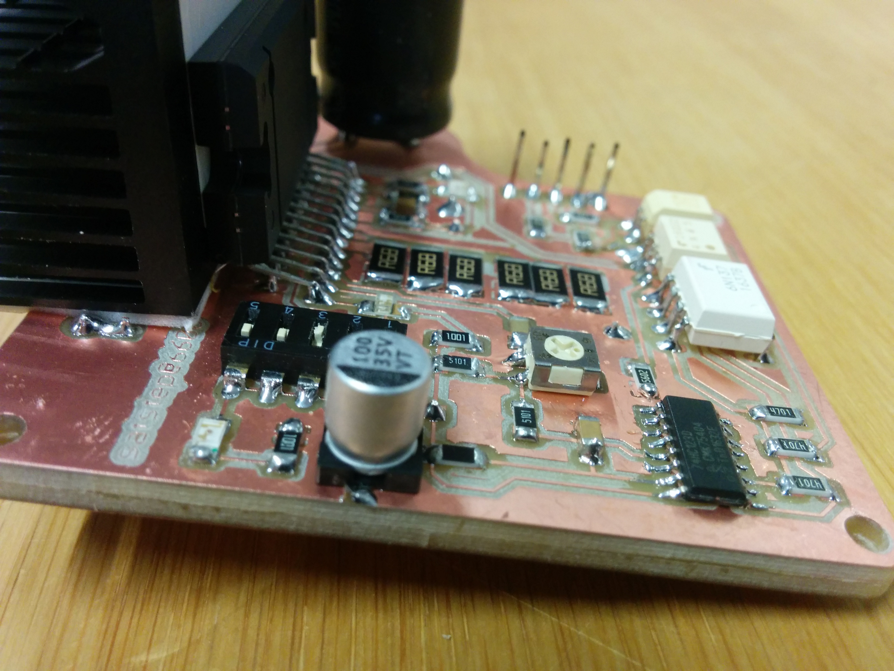
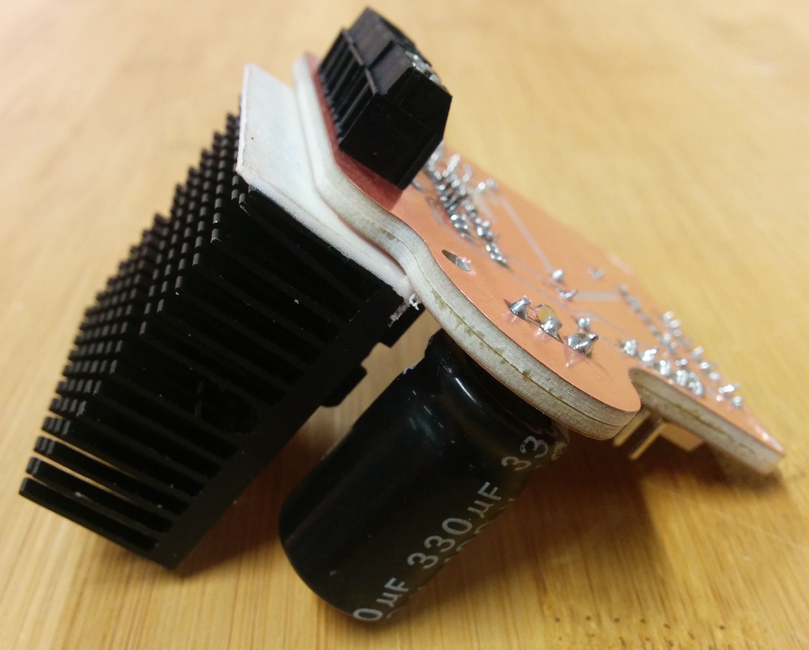
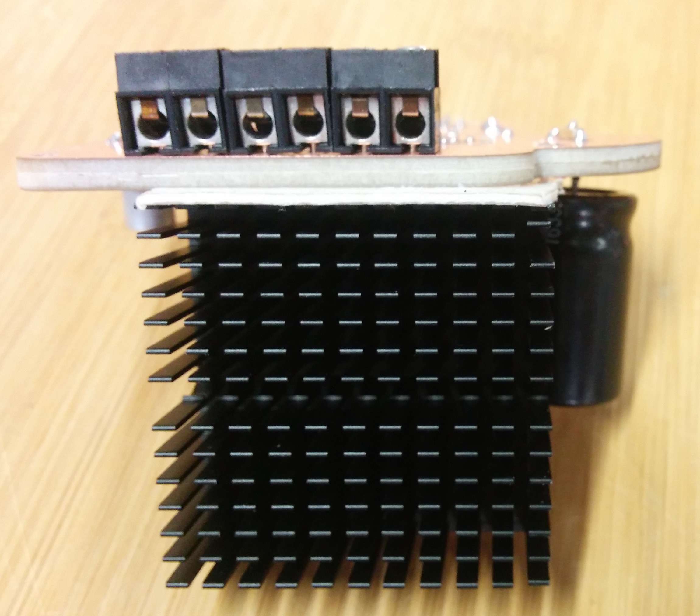

<h1 style="font-family: courier;" align="center"> satstep6600</h1>

<i>An open source & fabbable stepper driver based on TB6600.</i>

satstep6600
--

satstep6600 is a **low cost and fabbable** stepper driver. Inspired by the [PiBot TB6600 stepper driver](http://reprap.org/wiki/PiBot_TB6600_Stepper_Driver), satstep6600 is designed on purpose to maintain all the high power specs while being safe to be operated and easy to build, even using the stardard Fab Lab equipment.

satstep6600 features:

- chopper type stepper motor driver
- 5A peak output current, **4.5A** sustained maximum (over 2A a fan is recommended)
- 8-40V input voltage 
- 1/1, 1/2A(0-71-100%), 1/2B(0-100%), 1/4, 1/8, 1/16 stepping modes
- suitable for NEMA 17, NEMA 23 and few NEMA 34 stepper motors
- thermal shut down protection
- under voltage lock out protection
- over-current detection protection
- optoisolated for all the inputs
- 4 x M3 fixing holes
- board size of 70x63mm
- it costs **13 euro**

Getting started
--

To connect your satstep6600 have a look to its **pinout**:

and connect the pin as follows:

- **VCC** -> to the VCC of the power supply, supported voltage between 8-40V
- **GND** on top -> to the GND of the power supply
- **GND** on bottom right -> to the GND of your controller board (eg a [satshakit](https://github.com/satshakit/) or an Arduino)
- **DIR** -> to the direction pin of your controller board, this defines the direction of the rotation
- **CLK** -> to the CLK pin of your controller board, this is used to receive the signals to makes steps
- **EN** -> to a pin with digital signal of your controller board, LOW means ENABLED

To configure the driver you can use the 5 position dip switch and the trimmer. The trimmer will regulate the amount of current given to the motor. Please make sure that you will **never supply more current** than the amount in the datasheet of your stepper motor. **Rotating the trimmer towards 103 will increase the current.** For continous use over 2A is recommended to use a fan to cool down the driver. 

The dip swith will change other settings as the following list:
- **TQ on**: 100% input Vref, **TQ off**: 30% input Vref
- **LATCH on**: thermal shutdown and over current protection, **LATCH off**: only thermal shutdown
- **M1, M2, M3** define the stepping mode:
	- M1 off, M2 off, M3 off -> standby
	- M1 off, M2 off, M3 on -> 1/1
	- M1 off, M2 on, M3 off -> 1/2A (0-71-100%)
	- M1 off, M2 on, M3 on -> 1/2B
	- M1 on, M2 off, M3 off -> 1/4
	- M1 on, M2 off, M3 on -> 1/8
	- M1 on, M2 on, M3 off -> 1/16

Downloads
--

**downloads (right click, download as)**

- [satstep6600 board](https://github.com/satstep/satstep6600/raw/master/eagle/satstep6600.brd)
- [satstep6600 schematic](https://github.com/satstep/satstep6600/raw/master/eagle/satstep6600.sch)
- [satstep6600 top internal path png](https://github.com/satstep/satstep6600/raw/master/media/top_internal.png)
- [satstep6600 top external path png](https://github.com/satstep/satstep6600/raw/master/media/top_external.png)
- [satstep6600 bottom internal path png](https://github.com/satstep/satstep6600/raw/master/media/bottom_internal.png)
- [satstep6600 bottom external path png](https://github.com/satstep/satstep6600/raw/master/media/bottom_external.png)
- [satstep6600 board for 0.4 mills](https://github.com/satstep/satstep6600/raw/master/eagle/satstep6600_04/satstep6600.brd)
- [satstep6600 schematic for 0.4 mills](https://github.com/satstep/satstep6600/raw/master/eagle/satstep6600_04/satstep6600.sch)
- [satstep6600 for 0.4 mills top internal path png](https://github.com/satstep/satstep6600/raw/master/media/satstep6600_04/top_internal.png)
- [satstep6600 for 0.4 mills top external path png](https://github.com/satstep/satstep6600/raw/master/media/satstep6600_04/top_external.png)
- [satstep6600 for 0.4 mills bottom internal path png](https://github.com/satstep/satstep6600/raw/master/media/satstep6600_04/bottom_internal.png)
- [satstep6600 for 0.4 mills bottom external path png](https://github.com/satstep/satstep6600/raw/master/media/satstep6600_04/bottom_external.png)
- [satstep6600 BOM ods](https://github.com/satstep/satstep6600/raw/master/docs/satstep6600_BOM.ods)
- [satstep6600 BOM xlsx](https://github.com/satstep/satstep6600/raw/master/docs/satstep6600_BOM.xlsx)

Media
--

videos of satstep6600 moving NEMA 23 stepper motors:

other images of the satstep6600 driver board:

What's in the repo
--

- **[docs](https://github.com/satstep/satstep6600/tree/master/docs)**: BOM files
- **[egle](https://github.com/satstep/satstep6600/tree/master/eagle)**: eagle projects of the satstep6600 drive
- **[media](https://github.com/satstep/satstep6600/tree/master/media)**: svgs, connections schemas, images for cnc milling machine, other images

Authors
--

- Daniele Ingrassia

Contact
--

- **ingrassiada@gmail.com**
- **[linkedin](http://it.linkedin.com/in/danieleingrassia)**

Thanks
--

[Fablab Kamp-Lintfort](http://fablab.hochschule-rhein-waal.de/index.php/de/) 
Hochschule Rhein-Waal 
Friedrich-Heinrich-Allee 25, 47475 Kamp-Lintfort, Germany 
fablab@hochschule-rhein-waal.de

License
--

This work is licensed under the terms of the open source license: Creative Commons Attribution-ShareAlike 4.0 International ([CC BY-SA 4.0](https://creativecommons.org/licenses/by-sa/4.0/)).

Disclaimer  
--

This hardware/software is provided "as is", and you use the hardware/software at your own risk. Under no circumstances shall any author be liable for direct, indirect, special, incidental, or consequential damages resulting from the use, misuse, or inability to use this hardware/software, even if the authors have been advised of the possibility of such damages.

